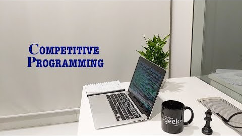

# 🎵 Playlists

Welcome to the **Playlists** repository! Explore a curated list of YouTube playlists covering essential topics. Whether you're learning to code, mastering system design, or exploring deep learning, you'll find it all here. 🌟

---

## 📘 Topics and Playlists

### 1. **Programming and Development**
- *Learn Bash scripting essentials for Linux systems.*  
  
- *Master TypeScript from the ground up.*  
  
- *Comprehensive course for Java programming and data structures.*  
  
- *Step into the world of Angular and build robust applications.*  
  
- *Dive into Spring Boot for enterprise application development.*  
  
- *Make real world Full Stack applications.*  
  
  

---

### 2. **Data and Databases**
- *Analyze data using Python and key libraries.*  
  
- *Prepare for database management system interviews.*  
  
- *Understand PostgreSQL database management.*  
  
  

---

### 3. **DevOps and System Design**
- *Learn the core concepts and practices of DevOps.*  
  
- *Master Docker for containerized applications.*  
  
- *Understand version control with Git.*  
  
- *Gain insights into scalable and efficient system designs.*  
  
  

---

### 4. **Interview Preparation**
- *Solve real-world coding problems with detailed explanations.*  
  
- *Excel at competitive programming with this comprehensive guide.*  
  
- *Prepare for technical interviews with this playlist.*  
  
  

---

### 5. **Deep Learning and Time Series**
- *Explore deep learning techniques for object detection.*  
  
- *Understand the principles and methods of time series analysis.*  
  
- *Basic to advanced concepts in Probability and Statistics.*  
  
- *Build basic understanding of deep learning and neural networks.*  
  
- *Concise lectures from IIT Madras on LLMs.*  
  
  

---

### 6. **Computer Systems**
- *Master OS concepts crucial for placement interviews.*  
  
- *A course all about information retrieval in different systems.*  
  
- *MIT's course for Distributed Systems.*  
  
  
